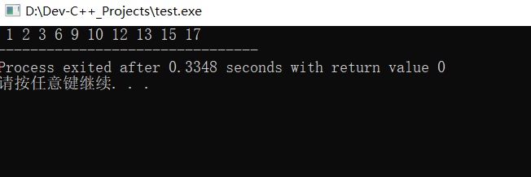

# 归并排序(Merge Sort)

基本思想：

> 归并排序（MERGE-SORT）是利用归并的思想实现的排序方法，该算法采用经典的分治（divide-and-conquer）策略（分治法将问题分(divide)成一些小的问题然后递归求解，而治(conquer)的阶段则将分的阶段得到的各答案"修补"在一起，即分而治之)。

## 分而治之


可以看到这种结构很像一棵完全二叉树，本文的归并排序我们采用递归去实现（也可采用迭代的方式去实现）。分阶段可以理解为就是递归拆分子序列的过程，递归深度为log2n。

再来看看**治**阶段，我们需要将两个已经有序的子序列合并成一个有序序列，比如上图中的最后一次合并，要将[4,5,7,8]和[1,2,3,6]两个已经有序的子序列，合并为最终序列[1,2,3,4,5,6,7,8]，来看下实现步骤。


# 代码实现：

```C
#include <iostream>
 
using namespace std;
 
void Merge(int *A,int *L,int leftCount,int *R,int rightCount) {
	int i,j,k;
 
	i = 0; j = 0; k =0;
 
	while(i<leftCount && j< rightCount) {
		if(L[i]  < R[j]) 
			A[k++] = L[i++];
		else 
			A[k++] = R[j++];
	}
	while(i < leftCount) A[k++] = L[i++];
	while(j < rightCount) A[k++] = R[j++];
}
 

void MergeSort(int *A,int n) {
	int mid,i, *L, *R;
	if(n < 2) return; 
 
	mid = n/2;  
 
	L = new int[mid];
	R = new int [n - mid];
 
	for(i = 0;i<mid;i++) 
		L[i] = A[i]; 	
	for(i = mid;i<n;i++) 
		R[i-mid] = A[i]; 
 
	MergeSort(L,mid); 
	MergeSort(R,n-mid);  
	Merge(A,L,mid,R,n-mid);  
	
	delete [] R;
	delete [] L;
}
 
int main() {
	int A[] = {6,2,3,1,9,10,15,13,12,17}; 
	int i,length;
 
	length = sizeof(A)/sizeof(A[0]);
 
	MergeSort(A,length);
 
	for(i = 0;i < length;i++)
	   cout << " " << A[i];
	return 0;
}
```

## 结果：

